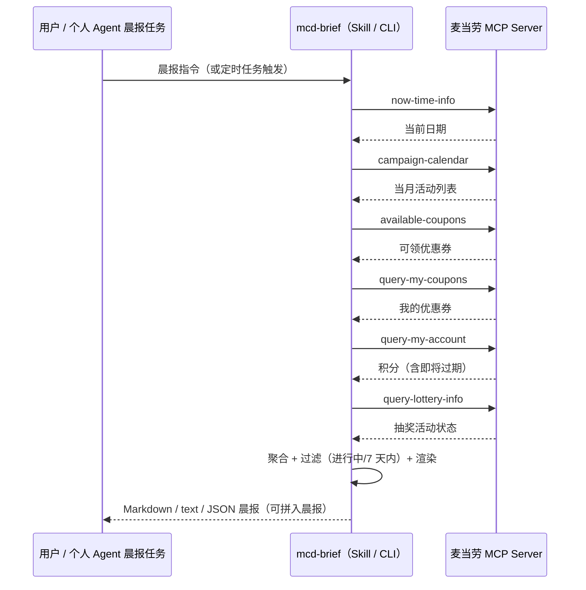
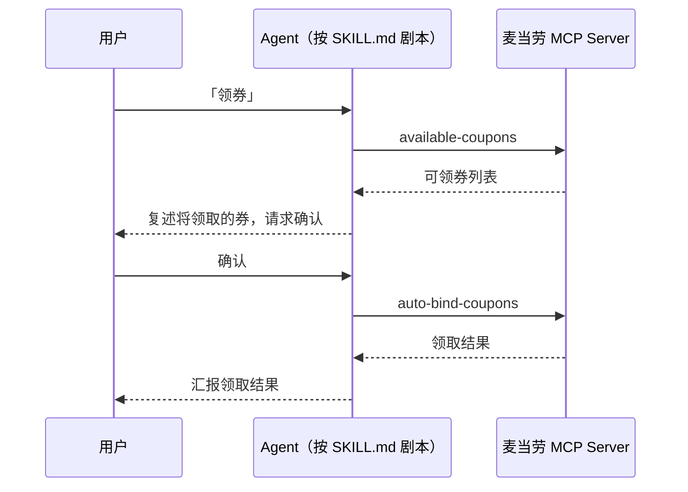

# MCP_INTEGRATION.md — 麦当劳 MCP 集成说明

本文档说明「麦麦晨报」实际使用的麦当劳 MCP Server、Tool、调用流程与业务价值。

## 1. 使用的 MCP Server

| 项 | 值 |
|---|---|
| Server | 麦当劳中国官方 MCP Server（`mcd-mcp`） |
| 接入地址 | `https://mcp.mcd.cn` |
| 传输协议 | Streamable HTTP |
| 认证方式 | `Authorization: Bearer <MCP_TOKEN>`（Token 通过 [open.mcd.cn/mcp](https://open.mcd.cn/mcp) 申请） |
| 接入配置 | 见仓库根目录 [`mcp-config.example.json`](./mcp-config.example.json)（仅含环境变量占位符） |
| 限流 | 每 Token 600 次/分钟；本项目每次生成晨报合计调用 ≤ 6 次，远低于限制 |

## 2. 使用的 Tool 及用途

| Tool | 名称 | 在项目中的作用 | 读/写 |
|---|---|---|---|
| `now-time-info` | 当前时间 | 锚定晨报日期，计算"还有 N 天开始" | 读 |
| `campaign-calendar` | 活动日历 | 晨报主栏目：筛选进行中 + 未来 7 天开始的活动 | 读 |
| `available-coupons` | 麦麦省券列表 | 晨报栏目：今日可领的优惠券 | 读 |
| `auto-bind-coupons` | 一键领券 | 用户回复"领券"并**确认后**执行 | 写 |
| `query-my-coupons` | 我的优惠券 | 晨报栏目：7 天内即将过期的券 | 读 |
| `query-my-account` | 积分账户 | 晨报栏目：可用积分 + **即将过期积分**预警 | 读 |
| `query-lottery-info` | 抽奖活动信息 | 晨报栏目：进行中的抽奖与免费次数 | 读 |
| `draw-lottery` | 积分抽奖 | 用户明确要求"抽一下"并**确认后**执行 | 写 |
| `query-my-prizes` | 我的奖品 | 抽奖后报告中奖结果 | 读 |

> 设计原则：**晨报生成本身全程只读**；两个写操作（领券、抽奖）只由用户在对话中的明确指令触发，且执行前必须再次确认。

## 3. 调用流程

### 3.1 晨报生成（核心流程，全程单会话批量调用）

实现说明：

- CLI 路径：`mcd_brief/aggregate.py::build_brief` 通过 `client.py::McdClient.call_many`
  在**同一次 MCP 会话**中顺序调用 6 个只读工具（一次握手，降低延迟与限流风险）；
- 任意一个工具失败不影响整份晨报：失败栏目记入 `errors`，渲染为"数据源告警"段落；
- MCP 响应为面向 LLM 的内容而非裸 JSON（实测）：`now-time-info`/`query-my-account`/`query-lottery-info` 在 "## Original Response" 后内嵌原始 JSON；`campaign-calendar`/`available-coupons`/`query-my-coupons` 返回 Markdown。解析层（`models.py`）先用平衡括号提取内嵌 JSON，再回退到 Markdown 分节/分块解析，并按多候选键名容错匹配；未知结构降级为空栏目而不是崩溃。

### 3.2 领券（写操作，确认后执行）

### 3.3 积分过期预警（晨报内自动完成）

`query-my-account` 返回中的"即将过期积分"字段被提取后，若存在则生成
"⚠️ N 积分即将过期（日期 前）"提醒，并可建议用户用积分商城（`mall-points-products`）消化。

## 4. 输出集成方式（业务价值）

| 集成方式 | 说明 |
|---|---|
| 个人 Agent 晨报栏目 | 把 `skill/SKILL.md` 安装进 WorkBuddy / Cursor / Trae / Cherry Studio / Claude Code 等 MCP 客户端，晨报任务自动附带"麦麦栏目" |
| 定时推送 | `python -m mcd_brief brief -f text` 输出纯文本，crontab / GitHub Actions 定时执行后推送到微信、飞书、Telegram、邮件等 |
| 手机日历 | `python -m mcd_brief calendar --ics mcd.ics` 导出 iCal，导入/订阅进系统日历，活动开始前有系统提醒 |
| 程序集成 | `python -m mcd_brief brief -f json` 输出结构化 JSON（含 `upcoming_campaigns`），供其他系统消费 |

## 5. 业务价值

1. **信息差变现**：麦当劳的活动与优惠券分散在 APP 首页、开屏、弹窗、麦麦省等多个入口，
   用户容易错过；晨报把它们压缩成 30 秒可读完的一条推送，**不错过第二份半价、
   会员日、买一送一**。
2. **止损型提醒**：优惠券过期、积分过期都是"已拥有资产的静默损失"，
   晨报把这两类到期信息前置提醒，直接为用户省钱。
3. **合规的自动化边界**：读操作全自动，写操作（领券/抽奖）必须确认，
   不碰下单与支付，符合个人 Agent "辅助而不越权"的定位。
4. **可组合性**：输出为标准 Markdown/JSON/iCal，天然可嵌入任意晨报管道，
   而不是再造一个 App。

## 6. 测试与验证

- 单元测试（离线，不依赖 Token）：`pip install -r requirements-dev.txt && pytest`
  覆盖聚合、过滤窗口、过期计算、容错解析、四种渲染器（16 个用例）；
- 真实链路：配置 `MCD_MCP_TOKEN` 后 `python -m mcd_brief brief` 即走真实 MCP Server；
  无 Token 时 `--demo` 使用内置样例数据离线体验全部输出格式；
- 错误路径：对无效 Token 已验证服务端返回 HTTP 401，客户端会探测真实状态码并给出可操作的提示。
